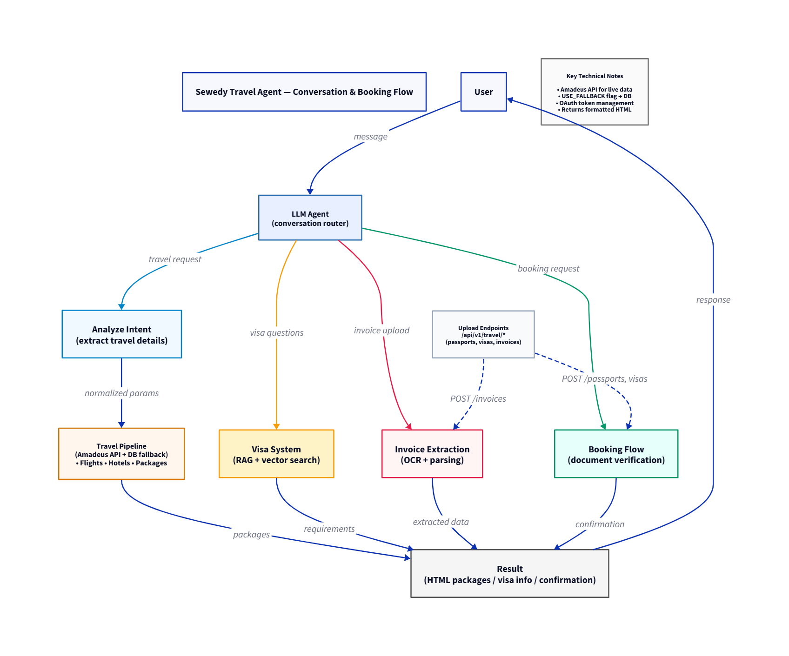

# write you project name

---

## 1️⃣ Project Domain (Business View)

# Sewedy Travel Agent

---

## 1️⃣ Project Domain (Business View)

Sewedy Travel Agent is a conversational travel assistant and document-processing platform built for El Sewedy corporate customers.

The system enables employees and travel administrators to:
- Ask general travel questions (web search + LLM enhancements).
- Run guided conversational travel searches (flights, hotels, packages) powered by Amadeus.
- Upload and extract structured data from invoices, passports and visas.
- Request visa requirement guidance backed by a Retrieval-Augmented-Generation (RAG) system over El Sewedy's visa documents.

Business value:
- Speeds up travel booking decisions and approvals.
- Automates extraction and verification of travel documents.
- Provides auditable, source-cited visa guidance for compliance.

---

## 2️⃣ Project Workflow (Technical View)

High-level flow:

- Client UI sends user chat messages and uploads to the FastAPI backend.
- Backend routes feed into a LangGraph state graph implementing nodes such as:
	- `llm_conversation_node` — runs prompt-driven extraction (Watsonx/OpenAI) producing structured search parameters.
	- `analyze_conversation_node` — validates parameters and produces follow-ups where needed.
	- `get_flight_offers_node` / `get_hotel_offers_node` — call Amadeus APIs to gather offers for multiple days.
	- `create_packages` / `summarize_packages` — build candidate travel packages and generate summaries/recommendations.
	- `booking_node` — verifies documents (passport/visa) and produces booking confirmation HTML and booking reference.
	- `visa_rag_node` — answers visa questions using pre-built country vector stores and returns citations.
	- `web_search_node` — optional web-search integrated with Tavily to return cleaned, clickable search results.
- Upload endpoints (`invoices`, `passports`, `visas`) extract and normalize data, store extracted JSON in Postgres, and render HTML for the UI.



---

## 3️⃣ Inputs vs Outputs

**Inputs:**
- Free-text user chats and follow-up replies.
- File uploads: invoices (PDF), passports (PDF/JPEG/PNG), visas (PDF/JPEG/PNG).
- Company-provided Excel of company hotels (`data/Company Hotels/...`).
- Environment variables (`.env`) containing API keys (AMADEUS, OPENAI/WATSONX, SMTP) and DB credentials.
- Pre-built visa document collections used to build vector stores under `data/visa_vector_stores`.

**Outputs:**
- Normalized extracted documents (JSON stored in Postgres JSONB fields).
- HTML snippets for previewing extracted invoices, passports, visas, and package/booking summaries.
- Travel package suggestions and a recommended (optimal) package with savings info.
- Visa guidance text with source citations and links to supporting documents.
- Booking references and booking metadata saved per conversation thread.

---

## 4️⃣ Used Packages / Purpose

| Package                         | Purpose                                     |
| ------------------------------- | ------------------------------------------- |
| FastAPI                         | Backend HTTP API                            |
| Uvicorn                         | ASGI server                                 |
| SQLAlchemy / asyncpg            | ORM and async Postgres connections          |
| Alembic                         | Database migrations                         |
| LangGraph / LangChain           | Conversation/agent workflow orchestration   |
| IBM Watsonx / OpenAI LLMs       | Extraction, summarization, reasoning        |
| FAISS / sentence-transformers   | Embeddings and vector search for RAG        |
| Pandas / openpyxl               | Company hotel sheet parsing                 |
| pdfplumber / PyMuPDF / OCR libs | PDF parsing and OCR for passports/invoices  |
| pypdf / python-multipart        | PDF handling and multipart uploads         |

---

## 5️⃣ Current Status

- FastAPI backend with routers: `auth`, `users`, `chat`, `invoices`, `passports`, `visas` (see `backend/routers`).
- LangGraph-based state graph and node implementations under `Nodes/` (flight/hotel/booking/visa nodes).
- Passport, visa and invoice upload + extraction utilities implemented in `Utils/`.
- Visa RAG implementation reading vector stores from `data/visa_vector_stores`.
- Postgres integration using an async engine (see `backend/database.py`).
- Skeleton Alembic migration scaffolding present in `backend/alembic`.

Known limitations:
- Occasional LLM hallucinations (mitigated by RAG and template prompts).
- Some country-specific visa embeddings need quality tuning.
- Edge cases in invoice normalization (various vendor formats).

---

## 6️⃣ Next Steps

- Improve embedding generation and filtering for visa RAG documents.
- Add stronger tool-based grounding for critical LLM outputs (e.g., booking steps).
- Add automated tests for node logic and router endpoints.
- Harden Alembic migration workflow and CI integration for DB changes.

---

## 7️⃣ Steps to Run Locally (concise)

Requirements:
- Python 3.13
- Postgres accessible locally or remotely

Recommended steps (copy/paste-friendly):

```powershell
# from project root
python -m venv .venv
.\.venv\Scripts\Activate.ps1
python -m pip install -r requirements.txt alembic sqlalchemy asyncpg psycopg2-binary

# prepare environment (copy or create .env with keys and DB creds)
copy .env .env.local
# edit .env.local to set DB_USER, DB_PASSWORD, DB_HOST, DB_PORT, DB_NAME, OPENAI_API_KEY, WATSON_APIKEY, PROJECT_ID, etc.

# run alembic migrations (from backend folder)
cd backend
python -m alembic revision --autogenerate -m "initial"  # generate if needed
python -m alembic upgrade head

# run the API
cd ..
uvicorn backend.main:app --reload --host 0.0.0.0 --port 8000
```

Verification:
- Visit `http://127.0.0.1:8000/health` to see the health check.
- Use API endpoints under `/api/v1/...` for auth, uploads and chat flows.

---

## Alembic notes
- Alembic env is configured to read DB credentials from environment variables and construct a sync
	SQLAlchemy URL for migrations. Ensure your `.env` is set before running `alembic` commands.
- If you need me to run the dependency install and apply migrations here, I can — but I will need
	network access and a reachable Postgres instance.

---

If you want, I can now: install dependencies and run the Alembic `upgrade head` command locally, or
I can just provide step-by-step guidance for you to run on your machine. Let me know which you prefer.
